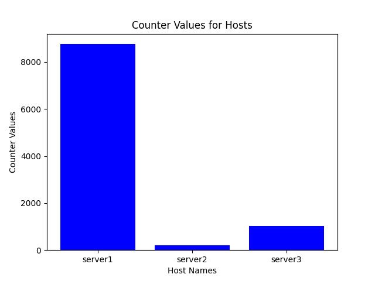
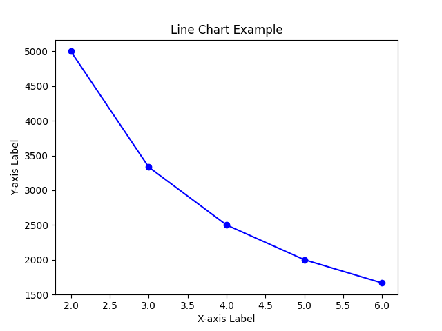
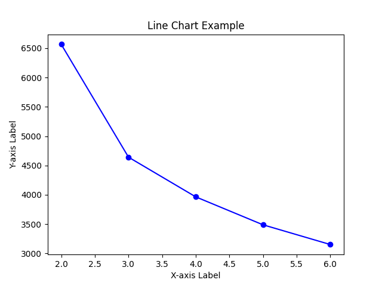
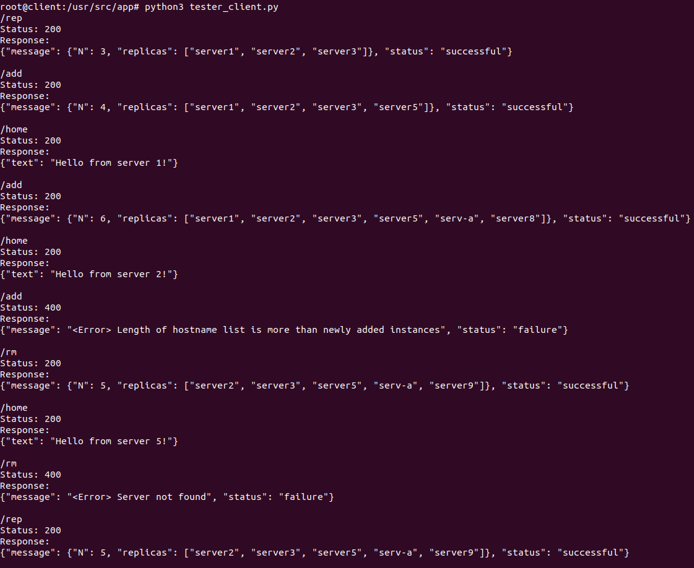
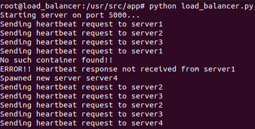
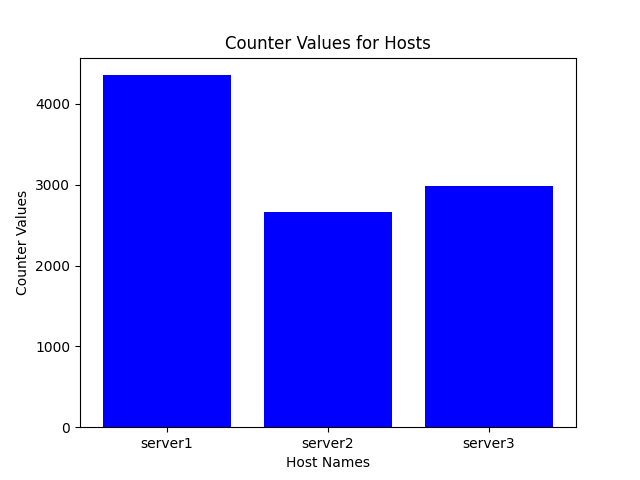
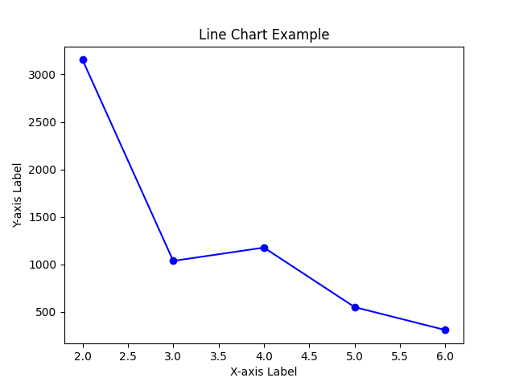

# Create a custom docker network (named "my_network")
```bash
docker network create my_network
```

# Create images of server, client and load balancer
```bash
make lb_image
make server_image
make client_image
```

# Spawn the load balancer container & mention number of initial container
```bash
make run_lb N=<number of initial containers>
```
(eg: make run_lb N=3, for 3 initial servers)

# Spawn the client container (which will open in the interactive mode)
```bash
make run_client
```

# Can optionally spawn server container
```bash
make run_server
```

# To see the logs of load balancer
```bash
make read_logs
```

# To run the analyse code
* First spawn the client container
* Then in the container, run the scaled_client_2.py
* Copy the image from client container to host machine (using docker cp)

# Data Structures and Server Management
This section provides an overview of the key data structures employed in the project, along with a description of server stoppage detection using heartbeat. Additionally, some assumptions made during the implementation are highlighted.

## 1. Data Structures
### 1.1 serv_dict
Description: A dictionary where the keys represent hostnames, and the corresponding values are lists containing virtual indices in the buffer, Docker container information, and the count of requests arrived at the server.

Purpose: Efficiently stores server-related information, facilitating quick retrieval and update operations.

### 1.2 serv_id_dict
Description: Functions as a set with operations optimized for finding the nearest clockwise servers. Utilizes O(log(n)) complexity for the lower_bound operation.

Purpose: Facilitates efficient identification of servers based on their unique IDs.

### 1.3 cont_hash
Description: The main buffer, implemented as a list of size 512*2, storing the positions of requests and server information.

Purpose: Acts as the primary data structure for managing requests and their associated servers.

### 1.4 Counter for Unique Server IDs
Description: A counter that increments to assign each server a unique ID.

Purpose: Ensures the uniqueness of server IDs for effective identification and management.

### 1.5 Mutex lock
Description: Used to protect the critical shared data structures maintained by the load balancer

Purpose: Ensures that only one thread is able to access and/or modify the contents of the critical section in order to prevent the race condition.

## 2. Server Stoppage Detection using Heartbeat
Description: Heartbeat signals are continuously sent to servers at regular intervals. If a server fails to respond to the heartbeat, it is considered unresponsive and subsequently removed. A new server is added to maintain the desired server count.

Implementation: Utilizes mutex locks for shared data structures to prevent race conditions during server addition or removal.

## 3. Assumptions
### Linear Probing in Hashing: 
Linear probing is employed in the hashing mechanism for handling collisions.
### Predefined Names:
The first key of the dictionary is removed when predefined names are not provided.
### Retries for Server Allocation:
There are a predefined number of retries for each request to find a free server in the buffer. A while loop is used for this purpose.

## 4. Special Points
### Used Multi-threaded server in load-balancer
Used Multi-threaded server in load-balancer to handle multiple client requests simultaneously

### Used Sorted Containers
Used Sorted Containers (similar to sets in C++) to find nearest server for a client in log(n) time complexity instead of linear search in otherwise linear array, thereby reducing the load per client request on the load balancer significantly.

### Timeout in /rm endpoint:
After deleting the entries from the data structures in the load balancer, a timeout of 20s is set in order to complete any pending client requests associated with the server. After the timeout is over, the container is finally stopped and removed. This is similar to how a TCP connection works after receving a FIN request, as it waits for all pending TCP packets.

## 5. New Hashing function
We've introduced prime multipliers for added complexity. Using prime numbers helps reduce the likelihood of collisions.
We've applied bitwise XOR with a magic number (0x5F3759DF). This bitwise operation can help improve the distribution of hash values.
Introduced different constant addition values for each hash function.
Used a different method of mixing bits by combining addition and XOR operations.


# Analysis
## A1 
### Bar Graph (Load balancer Original Hash)


We can see that the original hash functions doesnt work that well in allocating the servers to the client request. This bar graph shows its bias towards server1.

## A2 
### Average (for N=2-6, Load balancer Original Hash)


### Standard Deviation (for N=2-6, Load balancer Original Hash)


The standard deviation plot is a decreasing graph as its expected to be. There is a steep drop from n=2 to n=3 showcasing how the distribution and load distribution becomes better with increase in number of servers. We can also see the graph reaching a saturation point towards N=6 suggesting that there would be a specific number of servers at which the deviation change in the number of requests allocated to the servers becomes nearly constant.

## A3 (Testing)
### Testing the endpoints
Made a separate python script which can be executed as follows:
* Run the client container (if not currently running)
(NOTE: If client container is not in interactive mode, do "docker exec -it client bash" )
* Run the tester_client code (by executing "python3 tester_client.py")
* Observe the output on various test cases

Below are the results of a test run of the above mentioned script. 


Below is the case where one of the servers fail and load balancer spawns a new server in its place during the hearbeat call for this server.



## A4 (Modified Hash Function)
### Bar Graph


### Average (for N=2-6)


### Standard Deviation (for N=2-6)


The above diagrams show that the modified hash function works better in allocating the servers to the clients as compared to the original one. This can be seen from the equitable distribution between the 3 servers in the bar graph. The lower standard deviations proves that the modified hash function works better to distribute the requests.

These design choices and assumptions are made to ensure the efficiency, reliability, and responsiveness of the server management system. Contributors and users are encouraged to provide feedback and suggestions for further improvements.