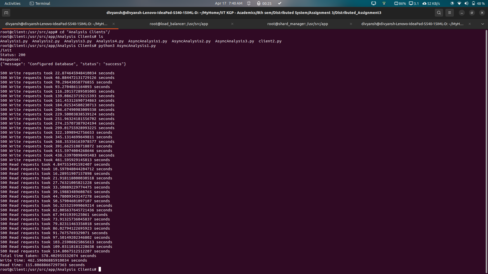
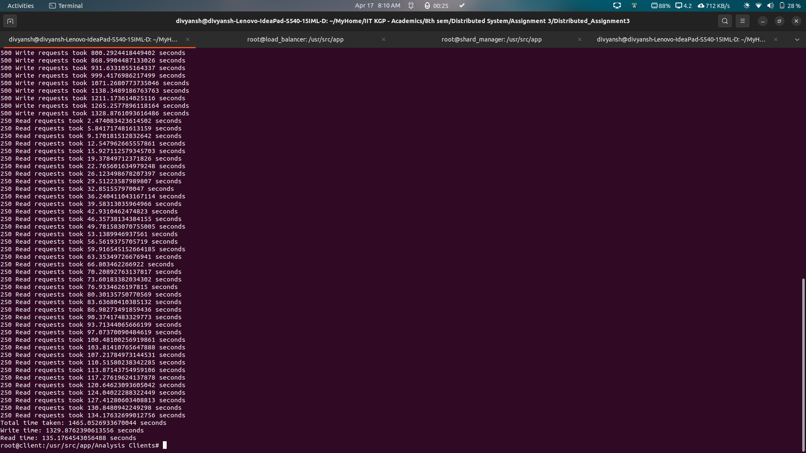
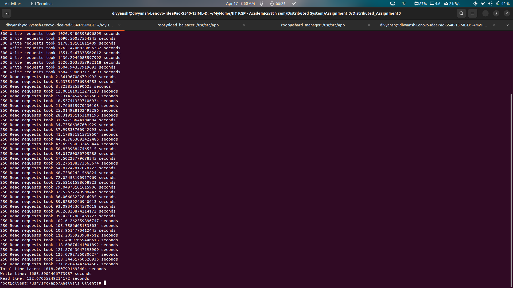

# Create a custom docker network (named "my_network")
```bash
make create_network
```

# Create images of server, client and load balancer
```bash
make lb_image
make server_image
make client_image
make shard_manager_image
```

# Spawn the load balancer and shard manager container
```bash
make run_lb_database # wait for around 30 seconds so that database container fully starts
make run_lb_script
make run_shard_manager
```

# Spawn the client container (which will open in the interactive mode)
```bash
make run_client
```

# Can optionally spawn server container
```bash
make run_server
```

# To see the logs of load balancer
```bash
make read_lb_logs
```

# To see the logs of a particular server
```bash
make read_server_logs sname=<server name>
```

# To run the analyse code
* First spawn the client container
* Then in the container, run the desired analysis (Analysis1.py, Analysis2.py, Analysis3.py, Analysis4.py)

# Data Structures and Server Management
This section provides an overview of the key data structures employed in the project, along with a description of server stoppage detection using heartbeat. Additionally, some assumptions made during the implementation are highlighted.

## 1. Data Structures
### 1.1 Server class
Description: Maintains mapping of server ID with corresponding docker container. It also has a mutex lock to protect the critical section during interaction with this server_id_to_container map.

Purpose: Facilitates efficient management of server information and ensures thread safety during server operations.

### 1.2 Shard class
Description: Maintains datastructures for each shard which are used for consistant hashing while interacting with this shard. It has a mutex lock to protect the critical section during interaction with this shard.


#### 1.2.1 serv_dict
Description: A dictionary where the keys represent server IDs which contain replicas of this shard, and the corresponding values are lists containing virtual indices in the buffer and current index information for this replics.

Purpose: Efficiently stores server-related information for each shard, facilitating quick retrieval and update operations.

#### 1.2.2 serv_id_dict
Description: Functions as a set with operations optimized for finding the nearest clockwise servers. Utilizes O(log(n)) complexity for the lower_bound operation.

Purpose: Facilitates efficient identification of servers based on their unique IDs.

#### 1.2.3 cont_hash
Description: The main buffer, implemented as a list of size 512*2, storing the positions of requests and server information.

Purpose: Acts as the primary data structure for managing requests and their associated servers.

#### 1.2.5 Mutex lock
Description: Used to protect the critical shared data structures maintained for this shard

Purpose: Ensures that only one thread is able to access and/or modify the contents of the critical section in order to prevent the race condition.

### 1.3 Shard ID to Shard Object Mapping
Description: Maintains a mapping of shard IDs to their corresponding shard objects.

Purpose: Facilitates efficient access to shard objects based on their unique IDs.

### 1.4 Metadata class
Description: Contain functions for interacting with metadata (ShardT and MapT) tables in the database. A single instance of this class is created and shared among all the shards.

Purpose: Provides a centralized mechanism for managing metadata operations, ensuring consistency and reliability.


## 2. Server Stoppage Detection using Heartbeat
Description: Heartbeat signals are continuously sent to servers at regular intervals. If a server fails to respond to the heartbeat, it is considered unresponsive and subsequently removed. A new server is added to maintain the desired server count.

If the server removed was a primary server of a certain shard or multiple shards, then new primary is elected for the required shard, where in the server with the most logs for the respective shard is chosen as the primary server

Implementation: Utilizes mutex locks for shared data structures to prevent race conditions during server addition or removal. 

## 3. Assumptions
### Linear Probing in Hashing: 
Linear probing is employed in the hashing mechanism for handling collisions.
### Retries for Server Allocation:
There are a predefined number of retries for each request to find a free server in the buffer. A while loop is used for this purpose.

## 4. Special Points and Design Choices
### Used Multi-threaded server and load-balancer
Used Multi-threaded server and load-balancer to handle multiple client requests simultaneously

### Used Sorted Containers
Used Sorted Containers (similar to sets in C++) to find nearest server for a client in log(n) time complexity instead of linear search in otherwise linear array, thereby reducing the load per client request on the load balancer significantly.

### Timeout in /rm endpoint:
After deleting the entries from the data structures in the load balancer, a timeout of 20s is set in order to complete any pending client requests associated with the server. After the timeout is over, the container is finally stopped and removed. This is similar to how a TCP connection works after receving a FIN request, as it waits for all pending TCP packets.


### Decision endpoint:
This endpoint is implemented in the servers, which is used by the primary server to notify secondary servers to commit or reject the previously requested query based on the number of responses received by the primary server for the request.


### Mutex Locks
Shard specific mutex locks are used for write, update and delete requests need to be served from the shard. This is done to ensure that only one thread can access the shard at a time. Whereas, for read requests, the shard is accessed without any locks.
Also, a mutex lock is used for the server_id_to_container map to ensure that only one thread can access the map at a time. It is used in init, add, rm and heartbeat endpoints.

## 5. New Hashing function
We've introduced prime multipliers for added complexity. Using prime numbers helps reduce the likelihood of collisions.
We've applied bitwise XOR with a magic number (0x5F3759DF). This bitwise operation can help improve the distribution of hash values.
Introduced different constant addition values for each hash function.
Used a different method of mixing bits by combining addition and XOR operations.

## 6. New WAL mechanism
Each server maintains log files for each shard. When a non-read request arrives, it is appended in the logs and only when the commit request arrives, the respective request is executed and committed.
The primary server is responsible for managing the commition of requests. The request is first sent to all secondary servers and if responses are received from majority of servers, it sends commit request to secondary servers, else asks not to execute/commit.


## 7. Management
* Load Balancer: Receives and manages all requests from clients
* Shard Manager: Manages heartbeat, addition and removal of servers, which includes election and management of primary servers.
* Primary Server: Responsible for management of execution of non read requests on all secondary servers


# Analysis
## A1 
Number of Shards: 4
Number of Servers: 6
Number of replicas: 2




## A2 
Number of Shards: 4
Number of Servers: 7
Number of replicas: 7




## A3 
Number of Shards: 6
Number of Servers: 10
Number of replicas: 8




## A4
### Testing the endpoints
Made a separate python script which can be executed as follows:
* Run the client container (if not currently running)
(NOTE: If client container is not in interactive mode, do "docker exec -it client bash" )
* Run the Analysis4 code (by executing "python3 tester_client.py")
* Observe the output on various test cases


These design choices and assumptions are made to ensure the efficiency, reliability, and responsiveness of the server management system. Contributors and users are encouraged to provide feedback and suggestions for further improvements.